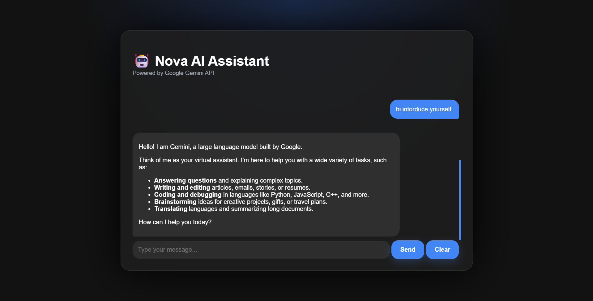
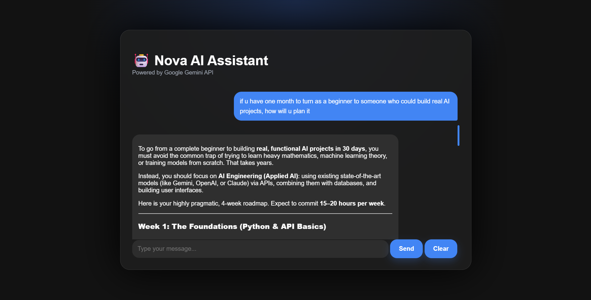

# 🤖 Nova AI Assistant

A modern AI chatbot built using **Python**, **Flask**, and **Google's Gemini API**. Nova AI Assistant features conversation memory, Markdown rendering, a clean responsive interface, and intelligent AI-powered responses.

---

## 📸 Preview

### Chat Demo



---

## ✨ Features

-  AI-powered conversations using Google's Gemini API
-  Conversation memory
-  Markdown formatted responses
-  Modern responsive UI
-  Clear Chat functionality
-  Fast Flask backend
-  Automatic detection of search-related prompts
-  Friendly error handling for API issues

---

## 🛠️ Tech Stack

| Technology | Usage |
|------------|-------|
| Python | Backend |
| Flask | Web Framework |
| HTML5 | Frontend |
| CSS3 | Styling |
| Google Gemini API | AI Responses |
| Markdown2 | Markdown Rendering |
| Git & GitHub | Version Control |

---

## 📂 Project Structure

```
Nova-AI-Assistant/
│
├── static/
│   └── style.css
│
├── templates/
│   └── index.html
│
├── screenshots/
│
├── app.py
├── requirements.txt
├── .gitignore
└── README.md
```

---

## 🚀 Installation

### 1. Clone the repository

```bash
git clone https://github.com/Anshul-Reddy/Nova-AI-Assistant.git
```

### 2. Move into the project

```bash
cd Nova-AI-Assistant
```

### 3. Create a virtual environment

```bash
python -m venv venv
```

### 4. Activate it

**Windows**

```bash
venv\Scripts\activate
```

**Linux / macOS**

```bash
source venv/bin/activate
```

### 5. Install dependencies

```bash
pip install -r requirements.txt
```

### 6. Create a `.env` file

```env
GEMINI_API_KEY=YOUR_API_KEY
```

### 7. Run the application

```bash
python app.py
```

Open:

```
http://127.0.0.1:5000
```

---

## 🧠 How It Works

1. User enters a message.
2. Flask receives the request.
3. Conversation history is maintained.
4. Gemini API generates a response.
5. Markdown responses are rendered into HTML.
6. The response is displayed in a modern chat interface.

---

## 🎯 Future Improvements

- 🌐 Live Google Search integration
- 🌙 Light/Dark mode toggle
- 📱 Improved mobile responsiveness
- 🔊 Voice input
- 🔈 Text-to-Speech
- 💾 Persistent chat history
- 👤 User authentication
- 🚀 Cloud deployment

---

## 👨‍💻 Author

**Anshul Reddy**

- GitHub: https://github.com/Anshul-Reddy
- LinkedIn: https://www.linkedin.com/in/k-anshul-reddy/

---

## ⭐ If you like this project

If you found this project useful or interesting, consider giving it a ⭐ on GitHub!

---
